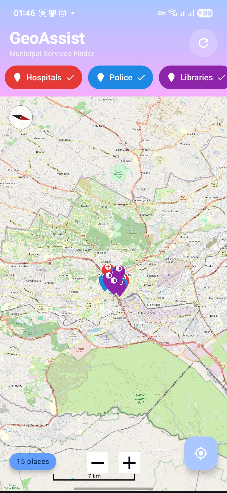
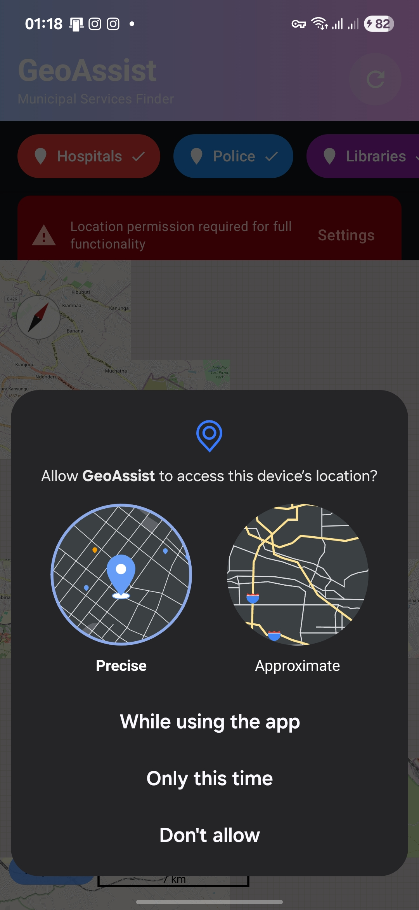
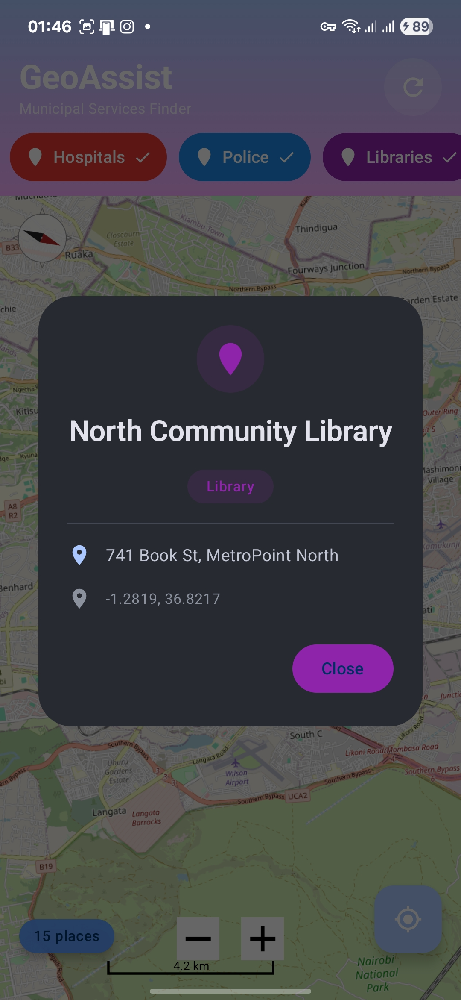

# GeoAssist

A modern Android application that helps citizens locate nearby public services such as hospitals, police stations, and libraries using GPS-based location services and OpenStreetMap.

## Features

- **Interactive Map**: OpenStreetMap rendering with zoom, scroll, compass, scale, and rotation gestures
- **Location Services**: Real-time GPS tracking with permission handling and accuracy display
- **Public Services (POIs)**: View hospitals, police stations, and libraries as interactive markers
- **Category Filtering**: Toggle visibility of different service categories
- **Distance Calculation**: Automatic distance computation from your current location
- **Offline Mode**: Full functionality with cached map tiles and local Room database storage

## Screenshots

| Home Screen | Permission Dialog | Place Details |
|:-----------:|:-----------------:|:-------------:|
|  |  |  |

## Architecture

The application follows the MVVM (Model-View-ViewModel) architecture pattern with a Repository layer:

```
UI Layer (Jetpack Compose)
    |
ViewModel
    |
Repository
    |
Room DAO / Volley Client
```

## Tech Stack

| Component | Technology |
|-----------|------------|
| Language | Kotlin |
| UI Framework | Jetpack Compose |
| Design | Material Design 3 |
| Mapping | OpenStreetMap (OSMdroid) |
| Database | Room |
| Networking | Volley |
| Architecture | MVVM |

## Setup Instructions

1. Clone the repository:
   ```bash
   git clone https://github.com/SiDeRaL12/GeoAssist.git
   ```

2. Open the project in Android Studio

3. Sync Gradle dependencies

4. Build and run on a device or emulator with Google Play Services (for location)

## Dependencies

All dependencies are defined in `gradle/libs.versions.toml`:

- AndroidX Core KTX
- Jetpack Compose (BOM, UI, Material 3)
- Room (Runtime, KTX, Compiler)
- OSMdroid
- Volley
- Kotlin Coroutines
- Lifecycle ViewModel

## Requirements

- Android Studio Hedgehog or later
- Android SDK 34
- Kotlin 1.9+
- Minimum SDK: 24
- Target SDK: 34

## Permissions

The application requires the following permissions:

- `ACCESS_FINE_LOCATION`: For precise GPS location
- `ACCESS_COARSE_LOCATION`: For approximate location
- `INTERNET`: For map tile downloads and POI loading
- `ACCESS_NETWORK_STATE`: For offline mode detection

## Author

Gustavo Sanchez

## License

This project is developed for educational purposes.
